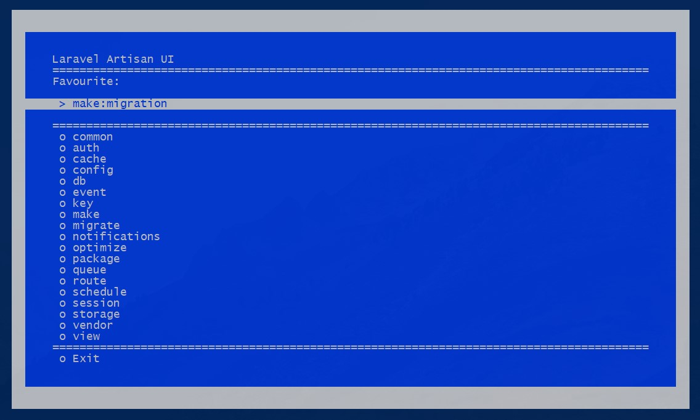

[](https://github.com/VladReshet/Artisanui/issues)
[](https://github.com/VladReshet/Artisanui/network)
[](https://github.com/VladReshet/Artisanui/stargazers)
[](https://github.com/VladReshet/ArtisanUI/blob/master/LICENSE)


🖥️ CLI User Interface for Laravel Artisan. Supports customizing (config/artisanui.php)!



## Installation

You can install the package via composer:

```bash
composer require vladreshet/artisanui --dev
```
after updating composer, do the next:
```bash
php artisan vendor:publish --tag=artisanui
```

That's all!

## Usage

You can use it via artisan "ui" command

``` bash
php artisan ui
```
or
``` bash
./artisan ui
```
_Note: This package doesn't work on Windows platforms._

## Contributing

Please see [CONTRIBUTING](CONTRIBUTING.md) for details.

### Security

If you discover any security related issues, please email vlreshet@gmail.com instead of using the issue tracker.

## Credits

- [Vlad Reshetilo](https://github.com/vladreshet)
- [All Contributors](../../contributors)

## License

The MIT License (MIT). Please see [License File](LICENSE.md) for more information.
